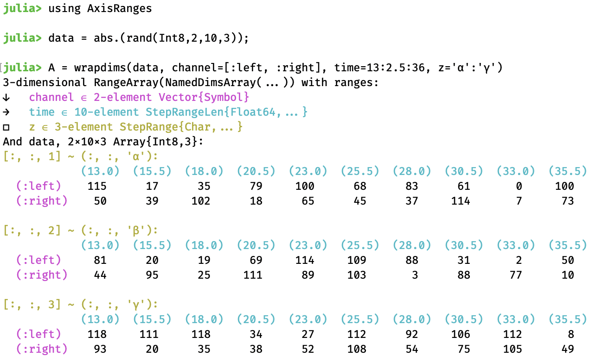

# AxisRanges.jl

[](https://travis-ci.org/mcabbott/AxisRanges.jl)

This package defines a thin wrapper which, alongside any array, stores an extra "range" 
for each dimension. This may be useful to store perhaps actual times of measurements, 
or some strings labeling columns, etc. These will be propagated through many 
operations on arrays, including broadcasting, `map`, comprehensions, `sum` etc.

It works closely with [NamedDims.jl](https://github.com/invenia/NamedDims.jl), 
which attaches names to dimensions. These names are a tuple of symbols, like those of 
a `NamedTuple`. They can be used for specifying which dimensions to sum over, etc.

The function `wrapdims` constructs a nested pair of these wrappers,
for example: 

```julia
using AxisRanges
data = rand(Int8, 2,10,3) .|> abs;
A = wrapdims(data; channel=[:left, :right], time=range(13, step=2.5, length=10), iter=31:33)
```

<center>
</img>
</center>

### Selections

Indexing still works directly on the underlying array, 
and keyword indexing works exactly as for a `NamedDimsArray`.
But in addition, it is possible to pick out elements based on the new ranges,
which for clarity we will call "lookup" based on a "key". 
This is written with round brackets:

|                    | Indexing            | Lookup              |
|--------------------|---------------------|---------------------|
| by position        | `A[1,2,:]`          | `A(:left, 15.5, :)` |
| by name            | `A[iter=1]`         | `A(iter=31)`        |
| `d` is a dimension | `index ∈ axes(A,d)` | `key ∈ ranges(A,d)` |   

When using dimension names, fixing only some of them will return a slice, 
such as `B = A[channel=1]`.
You may also give just one key, provided its type matches those of just one dimension,
such as `B = A(:left)` where the key is a Symbol.

There are also a numer of special selectors, which work like this:

|                 | Indexing         | Lookup                  |         |
|-----------------|------------------|-------------------------|---------|
| one nearest     | `B[time=3]`      | `B(time=Near(17.0))`    | vector  |
| all in a range  | `B[2:5, :]`      | `B(Interval(14,25), :)` | matrix  |
| all matching    | `B[3:end, 3:3]`  | `B(>(17), ==(33))`      | matrix  |
| mixture         | `A[1, 2, end]`   | `A(:left, Index[2], Index[end])` | scalar |
| non-scalar      | `B[iter=[1,3]]`  | `B(iter=[31, 33])`      | matrix  |

Here `Interval(13,18)` can also be written `13..18`, it's from [IntervalSets.jl](https://github.com/JuliaMath/IntervalSets.jl). 
Any functions can be used to select keys, including lambdas: `B(time = t -> 0<t<17)`. 
You may give just one `::Base.Fix2` function 
(such as `<=(18)` or `!=(20)`) provided its argument type matches the keys of one dimension.
An interval or a function always selects via `findall`, 
i.e. it does not drop a dimension, even if there is exactly one match. 

By default lookup returns a view, while indexing returns a copy unless you add `@views`. 
This means that you can write into the array with `B(time = <=(18)) .= 0`. 
For scalar output, you cannot of course write `B(13.0, 'α') = 0` 
as this parsed as a function definition, but you can write `B(13.0, 'α', :) .= 0`
as a trailing colon makes a zero-dimensional view.

(Possibly selectors should be made to work in square brackets too,
allowing mixed indexing `B[1, Key('β')] == B(Index[1], 'β')` 
and `setkey!` via `B[Key(13.0), Key('α')] = 0`. But they don't right now.)

### Functions

As usual `axes(A)` returns (a tuple of vectors of) indices, and `ranges(A)` returns keys.
If the array has names, then `names(A)` returns them, and functions like `axes(A, name)` 
give just one.

Many functions should work, for example:

* Reductions like `sum(A; dims=:channel)` can use dimension names. 
  Likewise `prod`, `mean` etc., and `dropdims`.

* Broadcasting `log.(A)` and `map(log, A)`, as well as comprehensions 
  `[log(x) for x in A]` should all work. 

* Transpose etc, `permutedims`.  

* Concatenation `hcat(B, B .+ 100)` works. 
  Note that the keys along the glued direction may not be unique afterwards.

* Some linear algebra functions like `*` and `\` will work. 

* Getproperty returns the range, to allow things like
  `for (i,t) in enumerate(A.time); fun(A[i], t); ...`.

* Vectors support `push!(V, val)`, which will try to extend the range. 
  There is also a method `push!(V, key => val)` which pushes the key into the range. 

To allow for this limited mutability, `V.ranges isa Ref` for vectors, 
while `A.ranges isa Tuple` for matrices & higher. But `ranges(A)` always returns a tuple.

### Absent

* There is no automatic alignment of dimensions by name. 
  Thus `A .+ A[iter=3]` is fine as both names and ranges line up, 
  but `A .+ B` is an error, as `B`'s first name is `:time` not `:channel`.
  (See [NamedPlus](https://github.com/mcabbott/NamedPlus.jl)`.@named` for something like this.)

As for [NamedDims.jl](https://github.com/invenia/NamedDims.jl), the guiding idea 
is that every operation which could be done on ordinary arrays 
should still produce the same data, but propagate the extra information (names/ranges), 
and error if it conflicts. 

Both packages allow for wildcards, which never conflict. 
In NamedDims.jl this is the name `:_`, here it is a range `Base.OneTo(n)`, 
like the `axes` of an `Array`. These can be constructed as 
`M = wrapdims(rand(2,2); _=[:a, :b], cols=nothing)`, 
and for instance `M .+ M'` is not an error. 

* There are no special types provided for ranges, they can be any `AbstractVector`s.
  Lookup happens by calling `i = findfirst(isequal(20.0), ranges(A,2))`, 
  or `is = findall(<(18), ranges(A,2))`.

If you need lookup to be very fast, then you will want to use a package like 
[UniqueVectors.jl](https://github.com/garrison/UniqueVectors.jl)
or [AcceleratedArrays.jl](https://github.com/andyferris/AcceleratedArrays.jl) 
or [CategoricalArrays.jl](https://github.com/JuliaData/CategoricalArrays.jl).
To apply such a type to all ranges, you may write 
`D = wrapdims(rand(1000), UniqueVector, rand(Int, 1000))`.
Then `D(n)` here will use the fast lookup from UniqueVectors.jl (about 60x faster).

When a dimension’s range is a Julia `AbstractRange`, then this package provides some faster 
overloads for things like `findall(<=(42), 10:10:100)`. 

* There is also no automatic alignment by keys, like time. 

But this can be done elsewhere...

### Elsewhere

This is more or less an attempt to replace [AxisArrays](https://github.com/JuliaArrays/AxisArrays.jl) 
with several smaller packages. The complaints are:
(1) It's confusing  to guess whether to perform indexing or lookup 
  based on whether it is given an integer (index) or not (key). 
(2) Each "range" was its own type `Axis{:name}` which allowed zero-overhead lookup
  before Julia 1.0. But this is now possible with a simpler design. 
  (They were called axes before `Base.axes()` was added, hence (3) the confusing terminology.)
(4) Broadcasting is not supported, as this changed dramatically in Julia 1.0.
(5) There are lots of assorted functions, special categorical vector types, etc. 
  which aren't part of the core.

Other older packages (pre-Julia-1.0):

* [NamedArrays](https://github.com/davidavdav/NamedArrays.jl) also provides names & ranges, 
ranges are always OrderedDict. Named lookup looks like `NA[:x => 13.0]` 
instead of `A(x=13.0)` here; this is not very fast. 
Dimension names & ranges can be set after creation. Has nice pretty-printing routines. 

* [LabelledArrays](https://github.com/JuliaDiffEq/LabelledArrays.jl) adds names for individual elements, more like a NamedTuple. 
Only for small sizes: the storage inside is a Tuple, not an Array.

* [AxisArrayPlots](https://github.com/jw3126/AxisArrayPlots.jl) has some plot recipes. 

* [OffsetArrays](https://github.com/JuliaArrays/OffsetArrays.jl) actually changes the indices
of an Array, allowing any continuous integer range, like `0:9` or `-10:10`.
This package is happy to wrap such arrays, 
and if needed will adjust indices of the given ranges:
`O = wrapdims(OffsetArray(["left", "mid", "right"], -1:1), 'A':'C')`, 
then `O[-1:0]` works.

Other new packages (post-1.0):

* [DimensionalData](https://github.com/rafaqz/DimensionalData.jl) is another replacement 
for AxisArrays. It again uses types like `Dim{:name}` to store both name & range, 
plus some special ones like `X, Y` of the same abstract type. 
Named lookup then looks like `DA[X <| At(13.0)]`, roughly like `A(x=13.0)` here.

* [NamedPlus](https://github.com/mcabbott/NamedPlus.jl) is some experiments using NamedDims. 
Function `align` permutes dimensions automatically, 
and macro `@named` can introduce this into broadcasting expressions. 

* [IndexedDims](https://github.com/invenia/IndexedDims.jl) like this package adds ranges 
on top of the names from NamedDims.
These ranges must always be [AcceleratedArrays](https://github.com/andyferris/AcceleratedArrays.jl). 
Like AxisArrays, it tries to guess whether to do indexing or lookup based on type. 

* [Dictionaries](https://github.com/andyferris/Dictionaries.jl) does very fast lookup only
(in our terminology) no indexing. Not `<: AbstractArray`, not a wrapped around an Array.
And presently only one-dimensional. 

And see [docs/speed.jl](docs/speed.jl) for some checks on this package, 
and comparisons to other ones.
And see [docs/repl.jl](docs/repl.jl) for some usage examples, showing pretty printing. 
For discussion, see [AxisArraysFuture](https://github.com/JuliaCollections/AxisArraysFuture/issues/1),
and [AxisArrays#84](https://github.com/JuliaArrays/AxisArrays.jl/issues/84).


In 🐍-land:

* [xarray](http://xarray.pydata.org/) does indexing `x[:, 0]` 
  and lookup by "coordinate label" as `x.loc[:, 'IA']`;
  with names these become `x.isel(space=0)` and `da.sel(space='IA')`. 

* [pandas](https://pandas.pydata.org) is really more like 
  [DataFrames](https://github.com/JuliaData/DataFrames.jl), only one- and two-dimensional.
  Writes indexing "by position" as `df.iat[1, 1]` for scalars or `df.iloc[1:3, :]` allowing slices,
  and lookup "by label" as `df.at[dates[0], 'A']` for scalars or `df.loc['20130102':'20130104', ['A', 'B']]` for slices, "both endpoints are *included*" in this.

<!--
### Words

This package isn't registered yet, partly because what to call things is unclear. 

1. Julia has adopted `index::Int ∈ axes(A,1)`. So I think these other structures need other names. 

2. From NamedDims.jl, each `name::Symbol` belongs to a dimension, `d ∈ 1:ndims(A)`. 

3. LabelledArrays.jl attaches a `label::Symbol` to every element of the array, 
  so that perhaps `A.label == A[2,2]`. 

4. For now I use `key` for the thing you lookup, but it could also be `label`? 
   I think a `value` is what `A[1,2]` returns. 

5. For now I use `ranges(A,1)` for the vector of possible keys. 
   But these do not have to be like `Base.range`'s `AbstractRange`s.
   Perhaps `scales(A,1)`? A scale of keys? `domains(A,1)`? 

6. The package could be  `AxisScales` (hard to say) or `LabelledDims` (how many `l`s again?)
   or `ScaledDims` or what?

7. The constructor function is `wrapdims` because it doesn't only make `RangeArray`s,
   but perhaps should match the package name better.


### About

Michael Abbott, 2019. 
-->

<!--
Terminology


Julia         | axes | index |  <i></i>  | <i></i> | <i></i> | <i></i>
--------------|------|-------|-----------|-------|-------|------
this package  | axes | index | names     | range | key   | meta
NamedDims     | axes | index | dimnames  |  -    | -     | -
AxisArrays    |      |       | axisnames | axis  | value | -
LabelledArrays| axes | ?     | ?         | ?     | name  | -
--------------|------|-------|-----------|-------|-------|------
Python        |  _   |   _    |  _       | _     |  _    | 
--------------|------|---------------|---------|-------|-------------------|------
xarrays       |  ?   | integer label | dims    | coords | coordinate label | attrs 
pytorch       |   ?  |  ?             | names   |  -    |     -            | - 


-->
