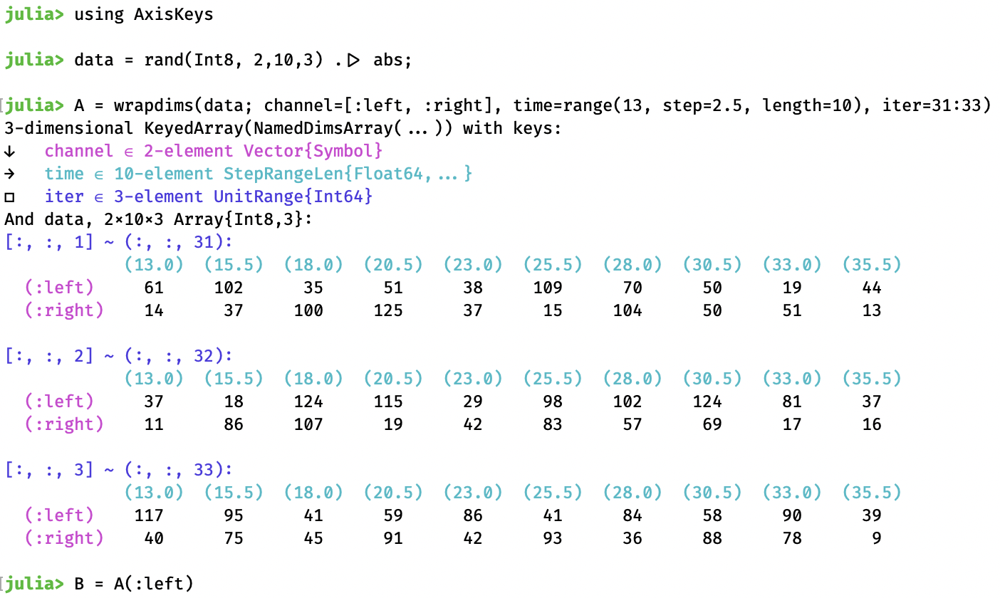

# AxisKeys.jl

[](https://github.com/mcabbott/AxisKeys.jl/blob/main/LICENSE)
[](https://github.com/mcabbott/AxisKeys.jl/dev)
[](https://github.com/mcabbott/AxisKeys.jl/actions?query=workflow%3ACI+branch%3Amaster)
[](https://pkgs.genieframework.com?packages=AxisKeys)


This package defines a thin wrapper which, alongside any array, stores a vector of "keys" 
for each dimension. This may be useful to store perhaps actual times of measurements, 
or some strings labeling columns, etc. These will be propagated through many 
operations on arrays (including broadcasting, `map`, comprehensions, `sum` etc.)
and altered by a few (sorting, `fft`, `push!`).

It works closely with [NamedDims.jl](https://github.com/invenia/NamedDims.jl), another wrapper 
which attaches names to dimensions. These names are a tuple of symbols, like those of 
a `NamedTuple`, and can be used for specifying which dimensions to sum over, etc.
A nested pair of these wrappers can be made as follows:

```julia
using AxisKeys
data = rand(Int8, 2,10,3) .|> abs;
A = KeyedArray(data; channel=[:left, :right], time=range(13, step=2.5, length=10), iter=31:33)
```

<p align="center">

</p>

The package aims not to be opinionated about what you store in these "key vectors":
they can be arbitrary `AbstractVectors`, and need not be sorted nor have unique elements.
Integer "keys" are allowed, and should have no surprising interactions with indices.
While it is further from zero-cost than [NamedDims.jl](https://github.com/invenia/NamedDims.jl), it aims to be light-weight,
leaving as much functionality as possible to other packages.

See <a href="#elsewhere">§ eleswhere</a> below for other packages doing similar things.

### Absent

* There is no automatic alignment of dimensions by name. 
  Thus `A .+ A[iter=3]` is fine as both names and keys line up, 
  but `A .+ B` is an error, as `B`'s first name is `:time` not `:channel`.
  (See [NamedPlus](https://github.com/mcabbott/NamedPlus.jl)`.@named` for something like this.)

As for [NamedDims.jl](https://github.com/invenia/NamedDims.jl), the guiding idea 
is that every operation which could be done on ordinary arrays 
should still produce the same data, but propagate the extra information (names/keys), 
and error if it conflicts. 

Both packages allow for wildcards, which never conflict. 
In NamedDims.jl this is the name `:_`, here it is a `Base.OneTo(n)`, 
like the `axes` of an `Array`. These can be constructed as 
`M = wrapdims(rand(2,2); _=[:a, :b], cols=nothing)`, 
and for instance `M .+ M'` is not an error. 

* There are no special types provided for key vectors, they can be any `AbstractVector`s.
  Lookup happens by calling `i = findfirst(isequal(20.0), axiskeys(A,2))`, 
  or `is = findall(<(18), axiskeys(A,2))`.

If you need lookup to be very fast, then you will want to use a package like 
[UniqueVectors.jl](https://github.com/garrison/UniqueVectors.jl)
or [AcceleratedArrays.jl](https://github.com/andyferris/AcceleratedArrays.jl) 
or [CategoricalArrays.jl](https://github.com/JuliaData/CategoricalArrays.jl).
To apply such a type to all dimensions, you may write 
`D = wrapdims(rand(1000), UniqueVector, rand(Int, 1000))`.
Then `D(n)` here will use the fast lookup from UniqueVectors.jl (about 60x faster).

When a key vector is a Julia `AbstractRange`, then this package provides some faster 
overloads for things like `findall(<=(42), 10:10:100)`. 

* There is also no automatic alignment by keys, like time. 
  But this could be done elsewhere?

* There is no interaction with interpolation, although this seems a natural fit.
  Why doesn't `A(:left, 13.7, :)` interpolate along continuous dimensions?

### Elsewhere

This is more or less an attempt to replace [AxisArrays](https://github.com/JuliaArrays/AxisArrays.jl) 
with several smaller packages. The complaints are:
(1) It's confusing  to guess whether to perform indexing or lookup 
  based on whether it is given an integer (index) or not (key). 
(2) Each "axis" was its own type `Axis{:name}` which allowed zero-overhead lookup
  before Julia 1.0. But this is now possible with a simpler design. 
  (They were called axes before `Base.axes()` was added, hence (3) the confusing terminology.)
(4) Broadcasting is not supported, as this changed dramatically in Julia 1.0.
(5) There are lots of assorted functions, special categorical vector types, etc. 
  which aren't part of the core, and are poorly documented.

Other older packages (pre-Julia-1.0):

* [NamedArrays](https://github.com/davidavdav/NamedArrays.jl) also provides names & keys, 
which are always `OrderedDict`s. Named lookup looks like `NA[:x => 13.0]` 
instead of `A(x=13.0)` here; this is not very fast. 
Dimension names & keys can be set after creation. Has nice pretty-printing routines. 
Returned by [FreqTables](https://github.com/nalimilan/FreqTables.jl).

* [LabelledArrays](https://github.com/JuliaDiffEq/LabelledArrays.jl) adds names for individual elements, more like a NamedTuple. 
Only for small sizes: the storage inside is a Tuple, not an Array.

* [AxisArrayPlots](https://github.com/jw3126/AxisArrayPlots.jl) has some plot recipes. 

* [OffsetArrays](https://github.com/JuliaArrays/OffsetArrays.jl) actually changes the indices
of an Array, allowing any continuous integer range, like `0:9` or `-10:10`.
This package is happy to wrap such arrays, 
and if needed will adjust indices of the given key vectors:
`O = wrapdims(OffsetArray(["left", "mid", "right"], -1:1), 'A':'C')`, 
then `O[-1:0]` works.

Other new packages (post-1.0):

* [Dictionaries](https://github.com/andyferris/Dictionaries.jl) does very fast lookup only
(in this terminology), with no indexing. Not `<: AbstractArray`, not a wrapped around an Array.
And presently only one-dimensional. 

* [NamedPlus](https://github.com/mcabbott/NamedPlus.jl) is some experiments using NamedDims. 
Function `align` permutes dimensions automatically, 
and macro `@named` can introduce this into broadcasting expressions. 

* [AxisSets](https://github.com/invenia/AxisSets.jl) builds on this package to handle groups of arrays as a `KeyedDataset`.

* [DimensionalData](https://github.com/rafaqz/DimensionalData.jl) is another replacement 
for AxisArrays. It again uses types like `Dim{:name}` to store both name & keys, although you
can use `Symbol` keys that are converted to types internally.
There are also some special ones like `X, Y` of the same abstract type (which must be in scope).
Named lookup can use these types `DA[X(At(:a))]`, or use the corresponding symbols `DA[X=At(:a)]`, for what this package would write `A(x=:a)` or `A[x=Key(:a)]`.

* [AxisIndices](https://github.com/Tokazama/AxisIndices.jl) differs mainly by storing 
the keys with the axes in its own `Axis` type. This is returned by `Base.axes(A)` 
(instead of `Base.OneTo` etc.) like [PR#6](https://github.com/mcabbott/AxisKeys.jl/pull/6).

See also [docs/speed.jl](docs/speed.jl) for some checks on this package, 
and comparisons to other ones.

In 🐍-land:

* [xarray](http://xarray.pydata.org/) does indexing `x[:, 0]` 
  and lookup by "coordinate label" as `x.loc[:, 'IA']`;
  with names these become `x.isel(space=0)` and `da.sel(space='IA')`. 

* [pandas](https://pandas.pydata.org) is really more like 
  [DataFrames](https://github.com/JuliaData/DataFrames.jl), only one- and two-dimensional.
  Writes indexing "by position" as `df.iat[1, 1]` for scalars or `df.iloc[1:3, :]` allowing slices,
  and lookup "by label" as `df.at[dates[0], 'A']` for scalars or `df.loc['20130102':'20130104', ['A', 'B']]` for slices, "both endpoints are *included*" in this.
  See also [Pandas.jl](https://github.com/JuliaPy/Pandas.jl) for a wrapper.
