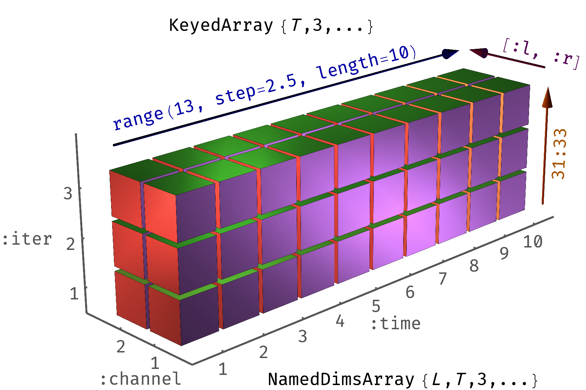

</img>

## AxisKeys.jl

This package defines a thin wrapper which, alongside any array, stores a vector of "keys" for each dimension. This may be useful to store perhaps actual times of measurements, or some strings labeling columns, etc. These will be propagated through many operations on arrays (including broadcasting, map, comprehensions, sum etc.) and altered by a few (sorting, fft, push!).


It works closely with [`NamedDims.jl`](https://github.com/invenia/NamedDims.jl), another wrapper which attaches names to dimensions. These names are a tuple of symbols, like those of a NamedTuple, and can be used for specifying which dimensions to sum over, etc. 

Start by adding the package:

```julia
]
add AxisKeys
```

Now, let's go to the next section for a quick intro.